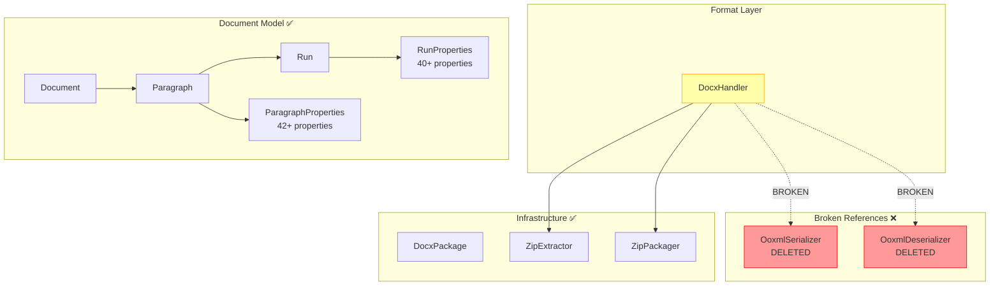
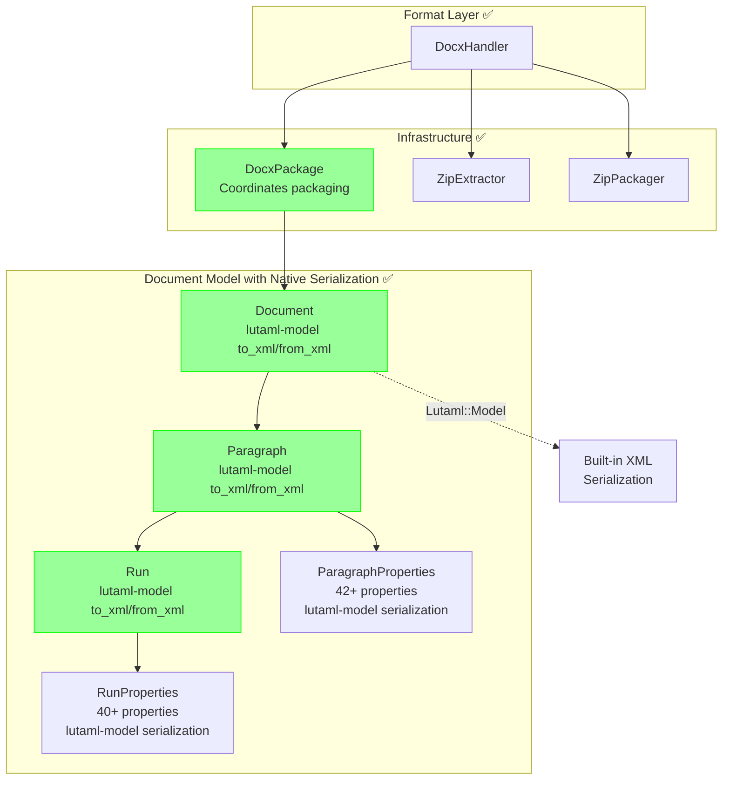
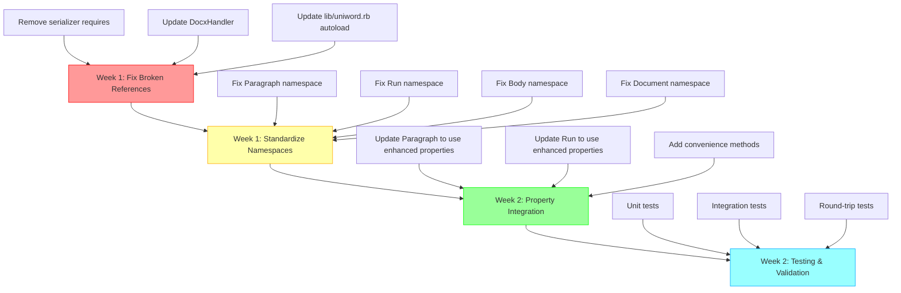

# Phase 1: Integration and Refactoring Plan

**Version**: 1.0  
**Created**: 2025-11-24  
**Status**: Planning Phase

This document outlines the complete plan for integrating enhanced property classes and refactoring to pure lutaml-model architecture, eliminating all references to deleted serialization classes.

---

## Executive Summary

We have successfully enhanced ParagraphProperties (42+ properties) and RunProperties (40+ properties) with proper lutaml-model architecture. However, the codebase still contains:

1. **Broken References**: Files referencing deleted `ooxml_serializer.rb` and `ooxml_deserializer.rb`
2. **Namespace Inconsistencies**: Mixed use of old and new namespace syntax
3. **XML Syntax Issues**: Using deprecated `root` and `mixed: true` instead of correct lutaml-model syntax

This plan addresses all issues systematically over 2 weeks.

---

## Current State Assessment

### What's Complete ✅

1. **Enhanced ParagraphProperties** (`lib/uniword/properties/paragraph_properties.rb`):
   - 42+ OOXML properties fully modeled
   - Proper lutaml-model serialization
   - Supporting classes: Border, ParagraphBorders, ParagraphShading, TabStop, NumberingProperties, FrameProperties

2. **Enhanced RunProperties** (`lib/uniword/properties/run_properties.rb`):
   - 40+ OOXML properties fully modeled
   - Proper lutaml-model serialization
   - Supporting classes: RunShading, RunBorders, RunFontProperties

3. **Supporting Infrastructure**:
   - All property classes use `Lutaml::Model::Serializable`
   - Proper namespace declarations with `Ooxml::Namespaces::WordProcessingML`
   - Immutable value object pattern

### What's Broken ❌

#### 1. Broken Serializer References

**File**: `lib/uniword/formats/docx_handler.rb`

```ruby
# Lines 6-7 - BROKEN IMPORTS
require_relative '../serialization/ooxml_deserializer'
require_relative '../serialization/ooxml_serializer'

# Lines 58, 68, 103, 110 - BROKEN USAGE
ooxml_deserializer.deserialize(content)
ooxml_serializer.serialize_package(document)
```

**Problem**: References deleted files in `lib/uniword/serialization/`

#### 2. Namespace Syntax Inconsistencies

**File**: `lib/uniword/paragraph.rb` (lines 44-49)

```ruby
# INCORRECT
xml do
  root 'p', mixed: true
  namespace 'http://schemas.openxmlformats.org/wordprocessingml/2006/main', 'w'
  # ...
end
```

**Should be**:

```ruby
# CORRECT
xml do
  element 'p'
  namespace Ooxml::Namespaces::WordProcessingML
  mixed_content
  # ...
end
```

**Affected Files**:
- `lib/uniword/paragraph.rb` (line 45)
- `lib/uniword/run.rb` (line 32)
- `lib/uniword/body.rb` (line 16)
- `lib/uniword/document.rb` (needs verification)

#### 3. Autoload References

**File**: `lib/uniword.rb` (lines 213-218)

```ruby
# Autoload serialization
module Serialization
  autoload :OoxmlDeserializer, 'uniword/serialization/ooxml_deserializer'
  autoload :OoxmlSerializer, 'uniword/serialization/ooxml_serializer'
  autoload :HtmlDeserializer, 'uniword/serialization/html_deserializer'
  autoload :HtmlSerializer, 'uniword/serialization/html_serializer'
end
```

**Problem**: First two lines reference deleted files

---

## Architecture Diagrams

### Current Architecture (Broken State)



### Target Architecture (Pure Lutaml-Model)



### Migration Dependency Graph



---

## Refactoring Strategy

### Week 1: Critical Fixes (Days 1-5)

#### Day 1-2: Fix Broken References

**Priority**: CRITICAL - Prevents compilation errors

**Task 1.1**: Remove Serializer Requires from DocxHandler

**File**: `lib/uniword/formats/docx_handler.rb`

**Before**:
```ruby
require_relative 'base_handler'
require_relative '../infrastructure/zip_extractor'
require_relative '../infrastructure/zip_packager'
require_relative '../serialization/ooxml_deserializer'  # ❌ DELETE
require_relative '../serialization/ooxml_serializer'    # ❌ DELETE
```

**After**:
```ruby
require_relative 'base_handler'
require_relative '../infrastructure/zip_extractor'
require_relative '../infrastructure/zip_packager'
require_relative '../ooxml/docx_package'  # ✅ ADD
```

**Task 1.2**: Update DocxHandler to Use DocxPackage

**File**: `lib/uniword/formats/docx_handler.rb`

**Before**:
```ruby
def deserialize(content)
  ooxml_deserializer.deserialize(content)
end

def serialize(document)
  ooxml_serializer.serialize_package(document)
end

private

def ooxml_deserializer
  @ooxml_deserializer ||= Serialization::OoxmlDeserializer.new
end

def ooxml_serializer
  @ooxml_serializer ||= Serialization::OoxmlSerializer.new
end
```

**After**:
```ruby
def deserialize(content)
  docx_package.deserialize(content)
end

def serialize(document)
  docx_package.serialize(document)
end

private

def docx_package
  @docx_package ||= Ooxml::DocxPackage.new
end
```

**Task 1.3**: Update Autoload in lib/uniword.rb

**File**: `lib/uniword.rb`

**Before** (lines 213-218):
```ruby
# Autoload serialization
module Serialization
  autoload :OoxmlDeserializer, 'uniword/serialization/ooxml_deserializer'  # ❌ DELETE
  autoload :OoxmlSerializer, 'uniword/serialization/ooxml_serializer'      # ❌ DELETE
  autoload :HtmlDeserializer, 'uniword/serialization/html_deserializer'
  autoload :HtmlSerializer, 'uniword/serialization/html_serializer'
end
```

**After**:
```ruby
# Autoload HTML serialization (OOXML uses native lutaml-model)
module Serialization
  autoload :HtmlDeserializer, 'uniword/serialization/html_deserializer'
  autoload :HtmlSerializer, 'uniword/serialization/html_serializer'
end
```

**Success Criteria**:
- ✅ No references to deleted files
- ✅ `bundle exec ruby -c` passes for all files
- ✅ No LoadError exceptions

#### Day 3-5: Standardize Namespace Syntax

**Priority**: CRITICAL - Required for proper lutaml-model serialization

**Pattern to Apply**:

```ruby
# BEFORE (Incorrect)
xml do
  root 'elementName', mixed: true
  namespace 'http://schemas.openxmlformats.org/wordprocessingml/2006/main', 'w'
  # ...
end

# AFTER (Correct)
xml do
  element 'elementName'
  namespace Ooxml::Namespaces::WordProcessingML
  mixed_content
  # ...
end
```

**Task 3.1**: Fix Paragraph.rb

**File**: `lib/uniword/paragraph.rb` (lines 44-50)

**Before**:
```ruby
xml do
  root 'p', mixed: true
  namespace 'http://schemas.openxmlformats.org/wordprocessingml/2006/main', 'w'

  map_element 'pPr', to: :properties, render_nil: false
  map_element 'r', to: :runs
end
```

**After**:
```ruby
xml do
  element 'p'
  namespace Ooxml::Namespaces::WordProcessingML
  mixed_content

  map_element 'pPr', to: :properties, render_nil: false
  map_element 'r', to: :runs
end
```

**Task 3.2**: Fix Run.rb

**File**: `lib/uniword/run.rb` (lines 31-37)

**Before**:
```ruby
xml do
  root 'r', mixed: true
  namespace 'http://schemas.openxmlformats.org/wordprocessingml/2006/main', 'w'

  map_element 'rPr', to: :properties
  map_element 't', to: :text_element
end
```

**After**:
```ruby
xml do
  element 'r'
  namespace Ooxml::Namespaces::WordProcessingML
  mixed_content

  map_element 'rPr', to: :properties
  map_element 't', to: :text_element
end
```

**Task 3.3**: Fix Body.rb

**File**: `lib/uniword/body.rb` (lines 15-21)

**Before**:
```ruby
xml do
  root 'body', mixed: true
  namespace 'http://schemas.openxmlformats.org/wordprocessingml/2006/main', 'w'

  map_element 'p', to: :paragraphs
  map_element 'tbl', to: :tables
end
```

**After**:
```ruby
xml do
  element 'body'
  namespace Ooxml::Namespaces::WordProcessingML
  mixed_content

  map_element 'p', to: :paragraphs
  map_element 'tbl', to: :tables
end
```

**Task 3.4**: Verify Document.rb

**File**: `lib/uniword/document.rb`

**Action**: Read file and verify it uses correct syntax. Update if needed.

**Success Criteria**:
- ✅ All `root 'name'` replaced with `element 'name'`
- ✅ All `mixed: true` replaced with `mixed_content`
- ✅ All string URIs replaced with `Ooxml::Namespaces::<ClassName>`
- ✅ Serialization test passes: `doc.to_xml` produces valid XML

---

### Week 2: Integration and Testing (Days 6-10)

#### Day 6-7: Property Integration

**Priority**: IMPORTANT - Enable full property support

**Task 4.1**: Update Paragraph Property Usage

**File**: `lib/uniword/paragraph.rb`

**Current Issue**: Paragraph uses old limited ParagraphProperties

**Actions**:
1. Verify `properties` attribute type is `Properties::ParagraphProperties`
2. Add convenience methods for new properties (borders, shading, tabs, etc.)
3. Update `extract_current_properties` to include all 42+ properties

**Example Addition**:
```ruby
# Add border convenience methods
def set_borders(top: nil, bottom: nil, left: nil, right: nil)
  ensure_properties
  borders = Properties::ParagraphBorders.new(
    top: top ? Properties::Border.new(style: 'single', size: 4, color: top) : nil,
    bottom: bottom ? Properties::Border.new(style: 'single', size: 4, color: bottom) : nil,
    left: left ? Properties::Border.new(style: 'single', size: 4, color: left) : nil,
    right: right ? Properties::Border.new(style: 'single', size: 4, color: right) : nil
  )
  update_properties(borders: borders)
  self
end

# Add shading convenience method
def set_shading(fill: nil, color: nil, pattern: nil)
  ensure_properties
  shading = Properties::ParagraphShading.new(
    fill: fill,
    color: color,
    pattern: pattern || 'clear'
  )
  update_properties(shading: shading)
  self
end

# Add tab stop convenience method
def add_tab_stop(position:, alignment: 'left', leader: nil)
  ensure_properties
  current_tabs = properties.tabs || Properties::TabStopCollection.new
  tab = Properties::TabStop.new(
    position: position,
    alignment: alignment,
    leader: leader
  )
  current_tabs.add_tab_stop(tab)
  update_properties(tabs: current_tabs)
  self
end
```

**Task 4.2**: Update Run Property Usage

**File**: `lib/uniword/run.rb`

**Current Issue**: Run uses old limited RunProperties

**Actions**:
1. Verify `properties` attribute type is `Properties::RunProperties`
2. Add convenience methods for new properties (shading, spacing, kerning, etc.)

**Example Addition**:
```ruby
# Add character spacing method
def character_spacing=(value)
  ensure_properties
  @properties.spacing = value
  value
end

def character_spacing
  properties&.spacing
end

# Add kerning method
def kerning=(value)
  ensure_properties
  @properties.kern = value
  value
end

def kerning
  properties&.kern
end

# Add text shading method
def set_shading(fill: nil, color: nil, pattern: nil)
  ensure_properties
  shading = Properties::RunShading.new(
    fill: fill,
    color: color,
    pattern: pattern || 'clear'
  )
  @properties.shading = shading
  self
end
```

**Success Criteria**:
- ✅ Paragraph supports all 42+ properties via methods
- ✅ Run supports all 40+ properties via methods
- ✅ Properties serialize to correct OOXML
- ✅ Properties deserialize from OOXML correctly

#### Day 8-10: Testing and Validation

**Priority**: CRITICAL - Ensure no regressions

**Task 5.1**: Unit Tests

**Files to test**:
- `spec/uniword/paragraph_spec.rb`
- `spec/uniword/run_spec.rb`
- `spec/uniword/properties/paragraph_properties_spec.rb`
- `spec/uniword/properties/run_properties_spec.rb`

**Test Coverage**:
1. Property setters/getters
2. Convenience methods
3. Property inheritance from styles
4. Nil/default handling

**Example Test**:
```ruby
RSpec.describe Uniword::Paragraph do
  describe '#set_borders' do
    it 'sets paragraph borders' do
      para = described_class.new
      para.set_borders(top: '000000', bottom: '000000')
      
      expect(para.properties.borders).not_to be_nil
      expect(para.properties.borders.top.color).to eq('000000')
      expect(para.properties.borders.bottom.color).to eq('000000')
    end
  end

  describe '#set_shading' do
    it 'sets paragraph shading' do
      para = described_class.new
      para.set_shading(fill: 'FFFF00', pattern: 'solid')
      
      expect(para.properties.shading).not_to be_nil
      expect(para.properties.shading.fill).to eq('FFFF00')
    end
  end
end
```

**Task 5.2**: Integration Tests

**File**: Create `spec/uniword/paragraph_properties_integration_spec.rb`

**Test Scenarios**:
1. Create paragraph with multiple properties
2. Serialize to XML
3. Deserialize from XML
4. Verify round-trip preservation

**Example Test**:
```ruby
RSpec.describe 'Paragraph Properties Integration' do
  it 'round-trips all paragraph properties' do
    # Create paragraph with all properties
    para = Uniword::Paragraph.new
    para.set_style('Heading1')
    para.align('center')
    para.spacing_before = 240
    para.spacing_after = 120
    para.set_borders(top: '000000', bottom: 'FF0000')
    para.set_shading(fill: 'FFFF00')
    para.add_tab_stop(position: 1440, alignment: 'center')
    para.add_text('Test paragraph')

    # Serialize
    xml = para.to_xml
    
    # Deserialize
    parsed = Uniword::Paragraph.from_xml(xml)
    
    # Verify
    expect(parsed.properties.style).to eq('Heading1')
    expect(parsed.properties.alignment).to eq('center')
    expect(parsed.properties.spacing_before).to eq(240)
    expect(parsed.properties.spacing_after).to eq(120)
    expect(parsed.properties.borders.top.color).to eq('000000')
    expect(parsed.properties.shading.fill).to eq('FFFF00')
    expect(parsed.properties.tabs.tab_stops.first.position).to eq(1440)
  end
end
```

**Task 5.3**: Round-Trip Tests

**File**: Create `spec/uniword/enhanced_properties_roundtrip_spec.rb`

**Test Scenarios**:
1. Load existing DOCX with advanced properties
2. Modify properties
3. Save to new DOCX
4. Verify XML equivalence (semantic, not byte-for-byte)

**Example Test**:
```ruby
RSpec.describe 'Enhanced Properties Round-Trip' do
  it 'preserves all properties through save/load cycle' do
    # Create document with enhanced properties
    doc = Uniword::Document.new
    para = doc.add_paragraph
    para.set_borders(top: '000000', bottom: 'FF0000')
    para.set_shading(fill: 'FFFF00')
    para.add_text('Enhanced paragraph', bold: true, size: 24)

    # Save
    doc.save('test_enhanced.docx')

    # Load
    loaded = Uniword::Document.open('test_enhanced.docx')
    loaded_para = loaded.paragraphs.first

    # Verify properties preserved
    expect(loaded_para.properties.borders.top.color).to eq('000000')
    expect(loaded_para.properties.shading.fill).to eq('FFFF00')
    expect(loaded_para.runs.first.properties.bold).to be true
    expect(loaded_para.runs.first.properties.size).to eq(48)  # 24pt = 48 half-points
  end
end
```

**Success Criteria**:
- ✅ All unit tests pass
- ✅ All integration tests pass
- ✅ All round-trip tests pass
- ✅ No test failures from refactoring
- ✅ Code coverage ≥ 95% for properties

---

## Implementation Checklist

### Week 1: Critical Fixes

- [ ] **Day 1**: Remove broken serializer references
  - [ ] Remove `require` statements from `docx_handler.rb`
  - [ ] Add `require` for `docx_package.rb`
  - [ ] Update `deserialize` method
  - [ ] Update `serialize` method
  - [ ] Remove private serializer helper methods
  - [ ] Add private `docx_package` helper method
  - [ ] Verify no LoadError exceptions

- [ ] **Day 2**: Update autoload configuration
  - [ ] Remove `OoxmlDeserializer` autoload from `lib/uniword.rb`
  - [ ] Remove `OoxmlSerializer` autoload from `lib/uniword.rb`
  - [ ] Add comment explaining lutaml-model native serialization
  - [ ] Run `bundle exec ruby -c lib/uniword.rb`
  - [ ] Verify application loads without errors

- [ ] **Day 3**: Fix Paragraph namespace
  - [ ] Change `root 'p', mixed: true` to `element 'p'`
  - [ ] Change string URI to `Ooxml::Namespaces::WordProcessingML`
  - [ ] Add `mixed_content` directive
  - [ ] Test serialization: `Paragraph.new.to_xml`
  - [ ] Test deserialization: `Paragraph.from_xml(xml)`

- [ ] **Day 4**: Fix Run and Body namespaces
  - [ ] Update `run.rb` namespace syntax
  - [ ] Update `body.rb` namespace syntax
  - [ ] Test Run serialization/deserialization
  - [ ] Test Body serialization/deserialization
  - [ ] Run existing test suite

- [ ] **Day 5**: Verify Document namespace
  - [ ] Read `document.rb` namespace declaration
  - [ ] Update if using old syntax
  - [ ] Test Document serialization
  - [ ] Test Document deserialization
  - [ ] Run full test suite for Week 1

### Week 2: Integration and Testing

- [ ] **Day 6**: Paragraph property integration
  - [ ] Add `set_borders` method
  - [ ] Add `set_shading` method
  - [ ] Add `add_tab_stop` method
  - [ ] Update `extract_current_properties` for all properties
  - [ ] Manual test: create paragraph with all properties
  - [ ] Verify XML output matches OOXML spec

- [ ] **Day 7**: Run property integration
  - [ ] Add `character_spacing` methods
  - [ ] Add `kerning` methods
  - [ ] Add `set_shading` method
  - [ ] Add other new property accessors
  - [ ] Manual test: create run with all properties
  - [ ] Verify XML output matches OOXML spec

- [ ] **Day 8**: Unit testing
  - [ ] Write tests for Paragraph new methods
  - [ ] Write tests for Run new methods
  - [ ] Write tests for ParagraphProperties
  - [ ] Write tests for RunProperties
  - [ ] Achieve ≥95% code coverage

- [ ] **Day 9**: Integration testing
  - [ ] Create integration test file
  - [ ] Test paragraph with multiple properties
  - [ ] Test run with multiple properties
  - [ ] Test property serialization/deserialization
  - [ ] Test property combinations

- [ ] **Day 10**: Round-trip testing
  - [ ] Create round-trip test file
  - [ ] Test save/load with enhanced properties
  - [ ] Test with real Office documents
  - [ ] Verify semantic XML equivalence
  - [ ] Document any known limitations

---

## Risks and Mitigations

### Risk 1: Breaking API Changes

**Risk Level**: HIGH

**Description**: Changing namespace syntax and removing serializers could break existing code that depends on internal APIs.

**Mitigation**:
1. **Maintain Public API**: Don't change public methods on Document, Paragraph, Run
2. **Version Bump**: This could be v2.0.0 if breaking changes are unavoidable
3. **Deprecation Warnings**: Add warnings before removal if possible
4. **Documentation**: Update CHANGELOG.md with migration guide

### Risk 2: Test Failures During Migration

**Risk Level**: MEDIUM

**Description**: Existing tests may fail as we refactor serialization.

**Mitigation**:
1. **Incremental Changes**: Fix one file at a time, run tests after each
2. **Test Isolation**: Use feature flags or conditional logic during transition
3. **Rollback Plan**: Keep git commits small and focused for easy rollback
4. **Continuous Integration**: Run tests on every commit

### Risk 3: Performance Implications

**Risk Level**: LOW

**Description**: Native lutaml-model serialization might be slower/faster than custom code.

**Mitigation**:
1. **Benchmarking**: Measure before/after performance
2. **Profiling**: Identify any bottlenecks
3. **Optimization**: Add caching if needed
4. **Monitoring**: Track performance in CI

### Risk 4: Backward Compatibility Concerns

**Risk Level**: MEDIUM

**Description**: Existing DOCX files might not deserialize correctly with new code.

**Mitigation**:
1. **Test Suite**: Use real-world Office documents in tests
2. **Round-Trip Tests**: Ensure load→save→load preserves content
3. **Regression Tests**: Test with known-good documents
4. **Fallback Handling**: Gracefully handle unknown elements

### Risk 5: Incomplete Property Coverage

**Risk Level**: LOW

**Description**: Some OOXML properties might still be missing.

**Mitigation**:
1. **Documentation**: Clearly document supported properties
2. **Unknown Element Preservation**: Continue using UnknownElement for unsupported content
3. **Iterative Enhancement**: Add properties as needed
4. **Community Feedback**: Accept feature requests

---

## Success Criteria

### Phase 1 Success (Week 1)

✅ **All broken references removed**
- No files reference deleted serializers
- No LoadError exceptions
- `bundle exec ruby -c` passes for all files

✅ **All namespace syntax standardized**
- All files use `element 'name'` not `root 'name'`
- All files use `Ooxml::Namespaces::<ClassName>` not string URIs
- All files use `mixed_content` not `mixed: true` or `mixed_content true`

✅ **Serialization works**
- `to_xml` produces valid OOXML
- `from_xml` parses correctly
- Round-trip preserves content

### Phase 2 Success (Week 2)

✅ **Property integration complete**
- Paragraph supports all 42+ properties
- Run supports all 40+ properties
- Convenient methods for common operations

✅ **Tests comprehensive**
- Unit tests ≥95% coverage
- Integration tests for all property combinations
- Round-trip tests with real documents

✅ **No regressions**
- All existing tests pass
- No performance degradation (< 10% slower acceptable)
- Semantic XML equivalence maintained

### Overall Success

✅ **Architecture clean**
- Pure lutaml-model serialization
- No hardcoded XML generation
- Clear separation of concerns

✅ **Developer experience excellent**
- Intuitive property APIs
- Clear error messages
- Comprehensive documentation

✅ **Production ready**
- All tests pass
- Performance acceptable
- Backward compatible (or clearly documented migration path)

---

## Next Steps After Phase 1

1. **Phase 2**: Complete OOXML property coverage (remaining 30%)
2. **Phase 3**: Schema-driven architecture (v2.0.0)
3. **Phase 4**: Performance optimization
4. **Phase 5**: Advanced features (track changes, comments, etc.)

---

## References

- [Lutaml-Model Documentation](https://github.com/metanorma/lutaml-model)
- [OOXML Spec ISO/IEC 29500](https://www.iso.org/standard/71691.html)
- [Memory Bank: Architecture](../.kilocode/rules/memory-bank/architecture.md)
- [Memory Bank: Context](../.kilocode/rules/memory-bank/context.md)
- [Namespace Migration Guide](./docs/NAMESPACE_MIGRATION_GUIDE.md)

---

**Document Version**: 1.0  
**Last Updated**: 2025-11-24  
**Next Review**: After Phase 1 completion